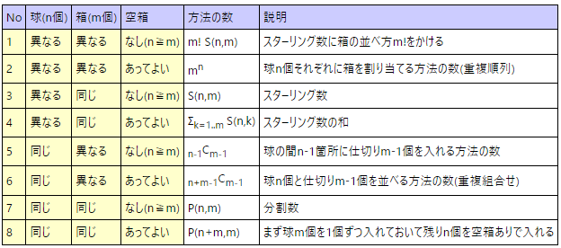

# 箱とボール問題
|No|球(n個)|箱(m個)|空箱|方法の数|説明|
|:-:|:-:|:-:|:-:|:-:|:-:|
|1|異なる|異なる|なし(n≧m)|m! S(n,m)|スターリング数に箱の並べ方m!をかける|
|2|異なる|異なる|あってよい|mn|球n個それぞれに箱を割り当てる方法の数(重複順列)|
|3|異なる|同じ|なし(n≧m)|S(n,m)|スターリング数|
|4|異なる|同じ|あってよい|Σk=1..m S(n,k)|スターリング数の和|
|5|同じ|異なる|なし(n≧m)|n-1Cm-1|球の間n-1箇所に仕切りm-1個を入れる方法の数|
|6|同じ|異なる|あってよい|n+m-1Cm-1|球n個と仕切りm-1個を並べる方法の数(重複組合せ)|
|7|同じ|同じ|なし(n≧m)|P(n,m)|分割数|
|8|同じ|同じ|あってよい|P(n+m,m)|まず球m個を1個ずつ入れておいて残りn個を空箱ありで入れる|

