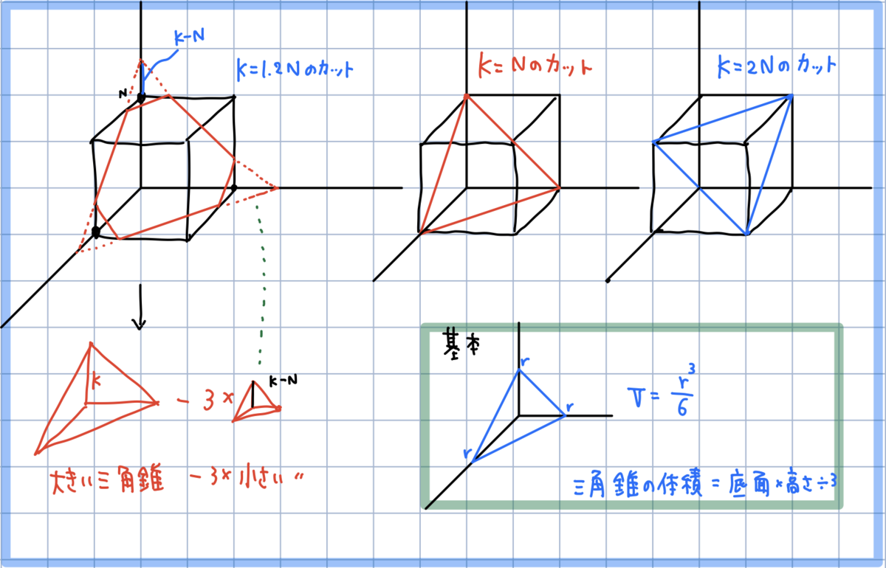

# 立方体のカット

https://atcoder.jp/contests/pakencamp-2020-day1/tasks/pakencamp_2020_day1_d



```
N, K = map(int,input().split())
if N >= K:
    V = K**3
elif K >= 3*N:
    V = 6*N**3
elif 2*N >= K:
    V = V = K**3 - 3*(K-N)**3
else:
    V = (6*N**3 - (3*N-K)**3)

print(V)


```